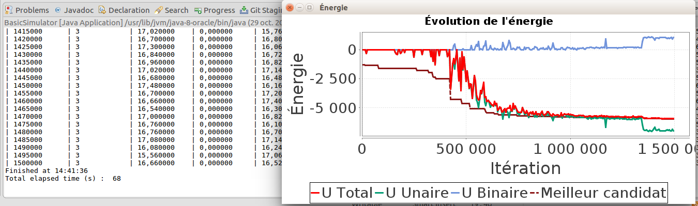

# Introduction

L'objectif de cette page est de lancer une première simulation très simple afin de voir comment se déroule une simulation de SimPLU3D. Cette simulation consiste à générer une forme composé de boites qui s'intersectent à partir d'un code exemple qui sera enrichi au fur et à mesure de cette documentation. Pour commencer, il est nécessaire  d'installer les codes de tutoriel comme précisé dans la [page d'installation](installation.md).

Le code utilisé dans cette page est dans la classe :  fr.ign.simplu3d.firstSimulation.BasicSimulator.

# Données d'entrée

Les données en entrée se trouvent dans le répertoire de ressources *resources/firstSimulation/*. Il s'agit du plus petit ensemble de données possible nécessaire pour exécuter SimPLU3D. Il contient deux dossiers :
- **data**: qui contient un fichier ShapeFile de parcelles (parcelle.shp) avec un attribut **id**. Ces parcelles définissent l'environnement géographique dans lequel se déroule la simulation, cet environnement géographique peut être enrichi d'autres objets déjà prévus dans SimPLU3D (vous trouverez plus d'informations dans [la section consacré à l'environnement géographique](/../envgeo/intro.md)) ;
- **scenario** : qui contient un fichier params.json qui contient la description des paramètres de la génération de forme (décrits dans la section dédiée aux [paramètres de la génération de formes](..//generator/custom-generator.md)) et des visiteurs qui seront exécutés pendant la simulation ([décrits dans la section dédiée aux visiteurs](../Visitor/intro.md)).


# Code de simulation

Le code à exécuter est repris ci-dessous commenté. On note qu'il y a 4 étapes nécessaires pour exécuter la simulation :

1. la création d'un [environnement géographique](/../envgeo/intro.md) ;
2. la définition de [contraintes morphologiques](/../rules/intro.md), à partir d'une classe de vérification de règles déjà implémentée ;
3. la définition d'un [générateur de formes](/../generator/intro.md), basé sur des boites ;
4. l'[export de résultats](export.md).

```Java
public static void main(String[] args) throws Exception {

  //Step 0 ; Defining an output existing folder
  String outputFolder = "/tmp/";

  // Step 1 : Creating the geographic environnement using the repository that contains the data

  // Load default environment (data are in resource directory)
  Environnement env = LoaderSHP.loadNoDTM(
      new File(BasicSimulator.class.getClassLoader().getResource("firstSimulation/data/").getPath()));

  // Select a parcel on which generation is proceeded
  BasicPropertyUnit bPU = env.getBpU().get(2);

  //Step 2 : Defining the regulation that will be applied during the simulation

  // Rules parameters.8
  // Distance to road
  double distReculVoirie = 2;
  // Distance to bottom of the parcel
  double distReculFond = 3;
  // Distance to lateral parcel limits
  double distReculLat = 4;
  // Distance between two buildings of a parcel
  double distanceInterBati = 0;
  // Maximal ratio built area
  double maximalCES = 0.5;

  //Instanciation of a predicate class
  SamplePredicate<Cuboid, GraphConfiguration<Cuboid>, BirthDeathModification<Cuboid>> pred = new SamplePredicate<>(
      bPU, distReculVoirie, distReculFond, distReculLat, distanceInterBati, maximalCES);


  //Step 3 : Defining the regulation that will be applied during the simulation


  // Instantiation of the sampler
  OptimisedBuildingsCuboidFinalDirectRejection oCB = new OptimisedBuildingsCuboidFinalDirectRejection();


  // Loading the parameters for the building shape generation
  String folderName = BasicSimulator.class.getClassLoader().getResource("firstSimulation/scenario/").getPath();
  String fileName = "params.json";
  SimpluParameters p = new SimpluParametersJSON(new File(folderName + fileName));


  // Run of the optimisation on a parcel with the predicate
  GraphConfiguration<Cuboid> cc = oCB.process(bPU, p, env, 1, pred);

  //4 - Writting the output
  SaveGeneratedObjects.saveShapefile(outputFolder + "out.shp", cc, bPU.getId(), 0);

}
```
# Exécution du code de simulation

Avant d'exécuter ce code, il est nécessaire de définir la variable outputFolder qui détermine le dossier dans lequel les résultats de la simulation seront exportés.

Une fois cette valeur fixée, vous pouvez exécuter le code.

Pendant le code, des informations sur l'avancement de la simulation seront affichées (pour en savoir plus la section [suivre l'évolution d'une simulation](../visitor/intro.md)).
Deux sorties sont visualisables pendant la simulation :
- Dans la console, un tableau représente durant les itérations des informations relatives à la simulation et notamment le nombre d'objets et la valeur de la fonction d'optimisation ;
- Dans une fenêtre, la valeur de la fonction d'optimisation (en rouge foncé) évolue au fur et à mesure des itérations. Dans ce cas, la valeur représentée est - le volume de la configuration (l'algorithme d'optimisation utilisé minimisant la valeur d'une fonction d'optimisation, c'est pour cela que la valeur évolue en diminuant).




# Résultats de la première simulation

La sortie est stockée sous la forme d'un ShapeFile *out.shp* qui contient les différentes boites avec des attributs :

- **id** : l'identifiant de la parcelle simulée ;
- **hauteur** : la hauteur de la boite ;
- **longueur** : la longueur de la boite ;
- **largeur** : la largeur de la boite ;
- **orient** : l'azimut de la boite ;
- **centerX**, **centerY** : les coordonnées du centre de la boite.

La géométrie est une géométrie 3D stockée sous la forme d'un multipolygoneZ.


Vous pouvez essayer de modifier le code pour tester les résultats sur différentes parcelles ou diffrentes variables de règles. [Dans la section suivante](../principe/intro.md), nous détaillons le principe de fonctionnement de la simulation.
