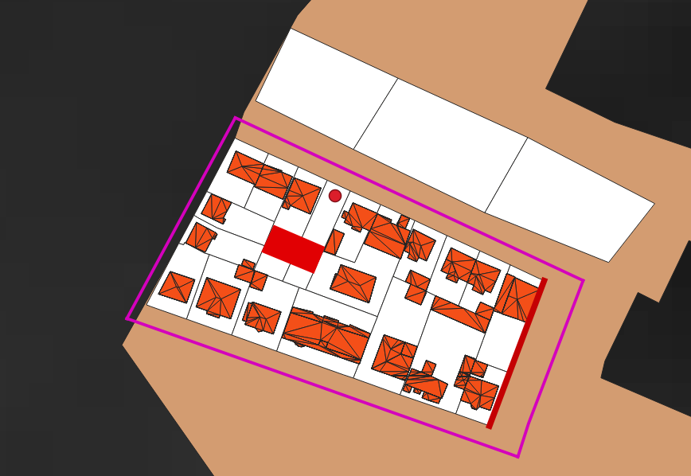

L'objectif de cette page est de proposer deux méthodes pour vérifier la bonne intégration des données à partir d'un jeu de données complet. Il est possible soit :
- d'exporter les instances du modèle sous forme de ShapeFiles ;
- de visualisation en 3D les informations du modèle.

Ces codes sont disponibles dans le projet du tutoriel dans le package *fr.ign.simplu3d.testIntegration*.

>  **Attention**: : pour ces codes, la visualisation 3D et le chargement de MNT nécessitent l'utilisation de bibliothèques natives Java 3D (qui se trouvent dans le projet SimPLU3d-tutorial). Il est nécessaire de passer à la VM l'argument suivant :

>
> **-Djava.library.path=./lib/native_libraries/linux-amd64**  
>
> La ligne précédente est définie pour Linux 64 bits, au besoin, il faut remplacer linux-amd64 par windows-i586 (windows 32bits), windows-amd64 (windows 64bits) ou linux-i386 (linux 32bits) en fonction de l'OS utilisé.

# Jeu de données

Un jeu de données complet suivant les [spécifications du processus d'intégration](integration.md) est disponible dans le dossier *resources/completeDataSet*. On peut voir ci-dessous une carte de ces données :

On peut noter dans ce jeu de données la présence d'un MNT et de bâtiments 3D avec un toit typifié (ce qui explique les polygones internes aux polygones de bâtiments).

# Export des informations du modèle sous forme de Shapefile

La classe *ExportAsShape* permet d'exporter l'instance de la classe *Environnement* sous forme de Shapefiles. Le code nécessite de déterminer un dossier de sortie pour pouvoir être appliqué (et il utilise le dossier de ressource qui se trouve dans le projet).

L'exécution du code génère une série de ShapeFiles représentés dans la carte suivante.

Les géométries en sortie sont triangulées car plaquées sur le MNT (s'il est utilisé). On retrouve les fichiers suivantes :

| Nom du fichier          | Contenu                                    | Attributs intéressants                                                                                                                                                                   |
|:------------------------|:-------------------------------------------|:-----------------------------------------------------------------------------------------------------------------------------------------------------------------------------------------|
| bpu.shp                 | Unités foncières                           |                                                                                                                                                                                          |
| parcelles.shp           | Parcelles                                  | **ID** : Code   **BounNum** : Nombre de limites séparatives   **BuildNum** : Nombre de bâtiments                                                                               |
| subParcels.shp          | Sous-parcelles                             | **NB Bat** : Nombre de parties de bâtiments                                                                                                                                              |
| bordures.shp            | Limites séparatives des parcelles          | **Type** : type de la limite   **IDPAR** : identifiant de la parcelle   **Adj** : Identifiant de la parcelle adjacente    **SIDE** : côté de la limite (droite ou gauche) |
| bordures_translated.shp | Limites séparatives translatée             | **Type** : type de la limite   **SIDE** : côté de la limite (droite ou gauche)                                                                                                       |
| opposites.shp           | Lien entre une limite et la limite opposée |                                                                                                                                                                                          |
| footprints.shp          | Emprise des bâtiments 3D                   |                                                                                                                                                                                          |
| faitage.shp             | Faîtage des bâtiments                      |                                                                                                                                                                                          |
| pignon.shp              | Pignons des bâtiments                      |                                                                                                                                                                                          |
| roads.shp               | Surface des routes                         | **Nom** : nom des routes                                                                                                                                                                 |

Les limites séparatives du fichier **bordures_translate.shp** sont translatées vers l'intérieur des parcelles auxquelles ils appartiennent pour des raison de lisibilité (afin d'éviter les superposition entre limites appartenant à des parcelles adjacentes).
Pour les valeurs des énumération **SIDE** et **Type** des limites séparatives, vous pouvez vous référer aux énumérations *ParcelBoundaryType* et *ParcelBoundarySide*.

# Visualisation 3D des informations du modèle

La classe *Integration3DViewer* permet une visualisation 3D d'un environnement. Il est possible de déterminer via une liste de thèmes, les informations à afficher dans la vue 3D. La liste des thèmes disponibles est consultable via l'énumération *RepEnvironnement.Theme*. Pour chaque thème, un rendu est prédéfini afin de visualiser les informations correspondantes.

Le visualisateur 3D utilisé est celui de GeOxygene3D vous trouverez plus de documentation sur comment représenter des données et sur comment naviguer sur [le site de GeOxygene](http://ignf.github.io/geoxygene/documentation/application/3d.html).

