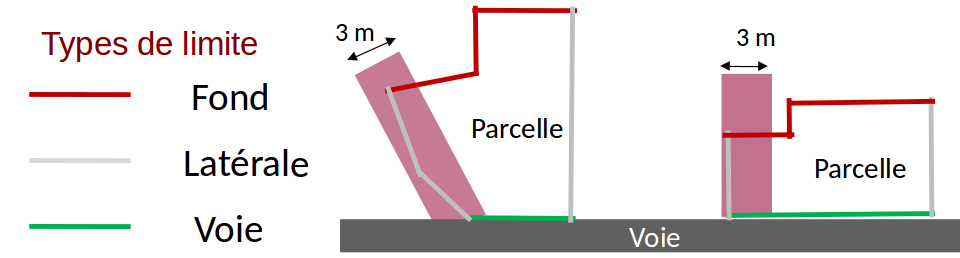

# Processus d'intégration

Un processus d'intégration est déjà défini dans SimPLU3D. Il permet de créer un objet de la classe *Environnement* en renseignant un certain nombre d'attributs.

Le processus d'intégration peut prendre en entrée des données au format ShapeFile (avec la classe *fr.ign.cogit.simplu3d.io.nonStructDatabase.shp.LoaderSHP* du dépot [SimPLU3D-rules](https://github.com/SimPLU3D/simplu3D-rules))  ou des données dans une base de données PostGIS (avec la classe *fr.ign.cogit.simplu3d.io.nonStructDatabase.postgis.loadPostGIS*, même dépot). Quel que soit l'approche choisie, les deux classes ont une méthode *load*, qui va traduire les entités provenant de ces sources de données en collection de *IFeature* de GeOxygene et faire appelle à la méthode *load* de la classe *fr.ign.cogit.simplu3d.io.LoadFromCollection* qui va instancier les entités du modèle.

Dans cette page, nous allons décrire tout d'abord les pré-requis en [fonction de la source de données utilisée](#sources-de-donnees-utilisees), puis décrire dans le détail [le processus d'intégration](#code-dintegration).

>  **Attention**: actuellement la persistance n'est pas gérée, donc le processus d'intégration automatique est pour le moment le seul moyen direct d'instancier le modèle géographique convenablement.


# Sources de données utilisées

La données utilisées pendant le processus d'intégration peuvent provenir de Shapefiles ou de PostGIS. Les classes permettant de lancer le processus et les constantes stockant le nom des sources de données utilisées  dépendent du choix de la source de données  [ShapeFiles](#source-de-donnees-shapefile) ou [PostGIS](#source-de-donnees-postgis). Dans tous les cas, seules les données parcellaires sont obligatoires.  Cependant, [les noms des attributs utilisés](#nom-des-attributs) sont les mêmes quelle que soit la source utilisée et sont stockés au même endroit dans le code.

## Source de données ShapeFile

La classe permettant de charger les données provenant de ShapeFiles et contenant le nom des fichiers est fr.ign.cogit.simplu3d.io.nonStructDatabase.shp.LoaderSHP.

| Source de données         | Nom de la variable           | Valeur par défaut     | Type de géométrie                        |
|:--------------------------|:-----------------------------|:----------------------|:-----------------------------------------|
| Document d'Urbanisme      | NOM_FICHIER_PLU              | doc_urba.shp          | Non utilisée                             |
| Zonage réglementaire      | NOM_FICHIER_ZONAGE           | zone_urba.shp         | (Multi-) Polygone 2D (sans intersection) |
| Parcelles                 | NOM_FICHIER_PARCELLE         | parcelle.shp          | Polygone 2D (sans intersection)          |
| Bâtiments                 | NOM_FICHIER_BATIMENTS        | batiment.shp          | Multi-Polygone 3D                        |
| Route                     | NOM_FICHIER_VOIRIE           | route.shp             | (Multi-) Linéaire 2D ou 3D               |
| MNT                       | NOM_FICHIER_TERRAIN          | mnt.asc               | MNT grille maillé                        |
| Prescriptions ponctuelles | NOM_FICHIER_PRESC_PONCTUELLE | prescription_pct.shp  | (Multi -) Ponctuelle 2D                  |
| Prescriptions linéaires   | NOM_FICHIER_PRESC_LINEAIRE   | prescription_lin.shp  | (Multi-) Linéaire 2D                     |
| Prescriptions surfaciques | NOM_FICHIER_PRESC_SURFACIQUE | prescription_surf.shp | (Multi-) Surfacique 2D                   |

## Source de données PostGIS

La classe permettant de charger les données provenant de PostGIS et contenant le nom des tables est *fr.ign.cogit.simplu3d.io.nonStructDatabase.postgis.LoaderPostGIS*. Le MNT est stocké comme un raster dans PostGIS.

| Source de données         | Nom de la variable       | Valeur par défaut | Type de géométrie                        |
|:--------------------------|:-------------------------|:------------------|:-----------------------------------------|
| Document d'Urbanisme      | NOM_TABLE_PLU            | plu               | Non utilisées                            |
| Zonage réglementaire      | NOM_TABLE_ZONAGE         | zonage            | (Multi-) Polygone 2D (sans intersection) |
| Parcelles                 | NOM_FICHIER_PARCELLE     | parcelle          | Polygones 2D (sans intersection)         |
| Bâtiments                 | NOM_TABLE_BATIMENTS      | batiment          | Multi-Polygone 3D                        |
| Route                     | NOM_TABLE_VOIRIE         | route             | (Multi-) Linéaire 2D ou 3D               |
| MNT                       | NOM_FICHIER_TERRAIN      | mnt               | MNT grille maillé                        |
| Prescriptions ponctuelles | NOM_TABLE_PRESC_PCT      | prescriptionpct   | (Multi -) Ponctuelle 2D                  |
| Prescriptions linéaires   | NOM_TABLE_PRESC_LINEAIRE | prescriptionlin   | (Multi-) Linéaire 2D                     |
| Prescriptions surfaciques | NOM_TABLE_PRESC_SURF     | prescriptionsurf  | (Multi-) Surfacique 2D                   |


## Nom des attributs

Pour les différentes sources de données, les noms des attributs utilisés dans le processus d'intégration sont stockées dans la classe : *fr.ign.cogit.simplu3d.io.feature.AttribNames*.  

### Document d'urbanisme

Les attributs utilisés ont été établis en accord avec la norme CNIG - COVADIS sur la dématérisalisation des documents d'urbanisme.

| Attribut          | Nom de la variable | Valeur par défaut | Type            |
|:------------------|:-------------------|:------------------|:----------------|
| Identifiant       | ATT_ID_URBA        | IDURBA            | String          |
| Type de document  | ATT_TYPE_DOC       | TYPEDOC           | String          |
| Date Approbation  | ATT_DATE_APPRO     | DATAPPRO          | Date (yyyyMMdd) |
| Date Fin          | ATT_DATE_FIN       | DATEFIN           | Date (yyyyMMdd) |
| Intercommunalité  | ATT_INTER_CO       | INTERCO           | String          |
| Numéro SIREN      | ATT_SIREN          | SIREN             | String          |
| État du document  | ATT_ETAT           | ETAT              | String          |
| Nom de la région  | ATT_NOM_REG        | NOMREG            | String          |
| URL de la région  | ATT_URL_REG        | URLREG            | String          |
| Nom du plan       | ATT_NOM_PLAN       | NOMPLAN           | String          |
| URL du plan       | ATT_URL_PLAN       | URLPLAN           | String          |
| Site web          | ATT_SITE_WEB       | SITEWEB           | String          |
| Type ref          | ATT_TYPE_REF       | TYPEREF           | String          |
| Date de référence | ATT_DATE_REF       | DATEREF           | Date (yyyy)     |


### Zonage réglementaire

Les attributs utilisés ont été établis en accord avec la norme CNIG - COVADIS sur la dématérisalisation des documents d'urbanisme.

| Attribut               | Nom de la variable  | Valeur par défaut | Type            |
|:-----------------------|:--------------------|:------------------|:----------------|
| Libellé                | ATT_LIBELLE         | LIBELLE           | String          |
| Libellé long           | ATT_LIBELONG        | LIBELONG          | String          |
| Type de zone           | ATT_TYPE_ZONE       | TYPEZONE          | String          |
| Destination dominante  | ATT_DESTDOMI        | DESTDOMI          | String          |
| Nom de fichier associé | ATT_NOMFIC          | NOMFIC            | String          |
| URL du fichier associé | ATT_URLFIC          | URLFIC            | String          |
| INSEE                  | ATT_INSEE           | INSEE             | String          |
| Date d'approbation     | VALIDITY_DATE_APPRO | DATAPPRO          | Date (yyyyMMdd) |
| Date de validation     | VALIDITY_DATE_VALID | DATVALID          | Date (yyyyMMdd) |
| Commentaires éventuels | ATT_TEXT            | TEXT              | String          |

### Parcelles

Chaque parcelle a un identifiant, il est soit encodé directement avec l'attribut *ATT_CODE_PARC* ou est construit par la concaténation des attributs valeurs des *ATT_BDP_CODE_DEP + ATT_BDP_CODE_COM + ATT_BDP_COM_ABS + ATT_BDP_SECTION + ATT_BDP_NUMERO* et accessible par la méthode *getCode* de la classe * fr.ign.cogit.simplu3d.model.CadastralParcel*.

L'attribut *ATT_HAS_TO_BE_SIMULATED* est facultatif et peut être utilisé pour indiquer s'il faut simuler ou non un parcelle. Il peut être boolean, entier (0 pour false et 1 pour true) ou même une chaîne de caractère (true ou false).


| Attribut                                 | Nom de la variable      | Valeur par défaut | Type                     |
|:-----------------------------------------|:------------------------|:------------------|:-------------------------|
| Identifiant de la parcelle               | ATT_CODE_PARC           | CODE              | String                   |
| Code du département                      | ATT_BDP_CODE_DEP        | CODE_DEP          | String                   |
| Code de la commune                       | ATT_BDP_CODE_COM        | CODE_COM          | String                   |
| Complément pour code INSEE               | ATT_BDP_COM_ABS         | COM_ABS           | String                   |
| Section cadastrale                       | ATT_BDP_SECTION         | SECTION           | String                   |
| Numéro de parcelle                       | ATT_BDP_NUMERO          | NUMERO            | String                   |
| Indique si la parcelle doit être simulée | ATT_HAS_TO_BE_SIMULATED | SIMUL             | Boolean, Integer, String |


### Bâtiments

Pas d'attribut utilisé.

### Route

| Attribut       | Nom de la variable | Valeur par défaut | Type   |
|:---------------|:-------------------|:------------------|:-------|
| Nom de la rue  | ATT_NOM_RUE        | NOM_RUE_G         | String |
| Largeur en m   | ATT_LARGEUR        | LARGEUR           | Double |
| Type de la rue | ATT_TYPE_ROAD      | NATURE            | String |


###  MNT

Pas d'attribut utilisé.

###  Prescriptions ponctuelles, linéaires et surfaciques

| Attribut                   | Nom de la variable    | Valeur par défaut | Type   |
|:---------------------------|:----------------------|:------------------|:-------|
| Type de prescription       | ATT_TYPE_PRESCRIPTION | TYPEPSC           | String |
| Libellé de la prescription | ATT_LABEL             | LIBELLE           | Double |
| Valeur de recul            | ATT_RECOIL            | RECOIL            | String |


# Code d'intégration


Le code d'intégration se trouve ci-dessous, il est composé de 12 étapes. Pour en savoir plus sur les différentes méthodes d'intégration, vous pouvez vous référer à la thèse de [Mickaël Brasebin (chapitre 2)](https://mbrasebin.github.io/publications/2014-these.pdf).

1. Création de l'objet PLU
2. Création des zones et assignation des règles aux zones
3. Affectation des zonages au PLU
4. Chargement des parcelles et créations des bordures
5. Import des sous parcelles
6. Création des unités foncières
7. Import des bâtiments et Assignation des bâtiments aux BpU
8. Chargement des voiries
9. Affectation des liens entre une bordure et ses objets adjacents (bordure sur route => route + relation entre les limites de parcelles)
10. Détection des limites séparatives opposées
11. Import des alignements
12. Affectation de la coordonnées Z à l'ensemble des éléments


Quelques étapes sont paramétrables :

La première étape vise à changer de référentiel les sources de données pour éviter des erreurs numériques dues à la grande taille de coordonnées utilisée. Ainsi, il est possible d'activer la transformation avec le boolean *Environnement.TRANSLATE_TO_ZERO* et en assignant des coordonnées (classe *DirectPosition* de GeOxygene) à l'attribut statique *Environnement.dpTranslate*.

Pendant l'étape d'annotation des limites séparatives en limites de fond, latérales et de voirie (étape
  4), le processus détermine automatiquement ces types. L'algorithme détermine tout d'abord les limites **donnant sur la voirie** en détectant celles qui se trouvent à l'extérieur de l'îlot formé par les parcelles connexes. Puis, les **limites latérales** sont détectées suivant une évaluation du dépassement de la limite séparative par rapport au point d'intersection avec la voirie (cf image suivante). Pour cette étape, il s'agit d'une méthode itérative, on sélectionne les limites donnant sur la voirie et non affectées comme étant des limites de voirie. Pour chacune de ces limites, on parcourt de proche en proche les limites adjacentes non étiquetées. Tant que ces limites sont incluses dans une boîte englobante orientée de largeur inférieure à la valeur du dépassement, on les étiquette comme latérales, sinon on arrête le parcours de proche en proche. Après avoir appliqué cette méthode, les limites restantes sont étiquetées comme de **fond de parcelle**.

  Par défaut, la valeur de dépassement jusqu'à laquelle les limites sont affectées comme latérales est de 3 m, mais elle peut être fixée en modifiant la valeur  *AbstractBoundaryAnalyzer.setThresholdIni(double)*. Pour les parcelles plus petites, le seuil est automatiquement ajusté pour atteindre 1/3 de la largeur de la boîte englobante orientée.

  Pour une parcelle n'ayant pas d'accès à la voirie, toutes les limites sont de type "Fond". Le côté (GAUCHE ou DROITE) des limites latérales est déterminée en regardant la parcelle depuis la voirie. Si une parcelle donne sur plusieurs voiries, les côtés DROITE et GAUCHE sont déterminés aléatoirement.




Pour les étapes qui recherchent des objets à proximité des limites séparatives comme les étapes 9 et 10, il est possible de fixer la distance maximale de recherche en fixant les valeurs : *NearestRoadFinder.setMaximumDistance()* pour la recherche de la voirie la plus proche d'une limite cadastrale et  *OppositeBoundaryFinder.setMaximalValue()* pour la recherche de la limite opposée à une limite cadastrale.


Afin de produire un référentiel 3D, les données 2D  parcelles, prescriptions, zonages et éventuellement voiries (si les données n'ont pas de Z) sont modifiées lors de la dernière étape dans la classe *fr.ign.cogit.geoxygene.api.feature.IFeatureCollection.AssignZ*. Deux types de transformation sont possibles :
- Si le MNT est défini, les objets sont projetés à la surface de ce MNT ;
- S'il n'est pas défini, un plan Z constant est utilisé (et fixé à travers la variable statique AssignZ.DEFAULT_Z ayant 0 comme valeur par défaut).


```JAVA
public static Environnement load(IFeature featPLU, IFeatureCollection<IFeature> zoneColl,
    IFeatureCollection<IFeature> parcelleColl, IFeatureCollection<IFeature> voirieColl,
    IFeatureCollection<IFeature> batiColl, IFeatureCollection<IFeature> prescriptions,
    AbstractDTM dtm, Environnement env) throws Exception {

  // Etape 0 : doit on translater tous les objets ?

  if (Environnement.TRANSLATE_TO_ZERO) {
    Environnement.dpTranslate = zoneColl.envelope().center();
    for (IFeature feat : zoneColl) {
      feat.setGeom(feat.getGeom().translate(-Environnement.dpTranslate.getX(),
          -Environnement.dpTranslate.getY(), 0));
    }
    for (IFeature feat : parcelleColl) {
      feat.setGeom(feat.getGeom().translate(-Environnement.dpTranslate.getX(),
          -Environnement.dpTranslate.getY(), 0));
    }
    for (IFeature feat : voirieColl) {
      feat.setGeom(feat.getGeom().translate(-Environnement.dpTranslate.getX(),
          -Environnement.dpTranslate.getY(), 0));
    }
    for (IFeature feat : batiColl) {
      feat.setGeom(feat.getGeom().translate(-Environnement.dpTranslate.getX(),
          -Environnement.dpTranslate.getY(), 0));
    }
    for (IFeature feat : prescriptions) {
      feat.setGeom(feat.getGeom().translate(-Environnement.dpTranslate.getX(),
          -Environnement.dpTranslate.getY(), 0));
    }
  }

  // Etape 1 : création de l'objet PLU
  logger.info("Read UrbaDocument...");
  UrbaDocument plu;
  if (featPLU == null) {
    plu = new UrbaDocument();
  } else {
    UrbaDocumentReader urbaDocumentReader = new UrbaDocumentReader();
    plu = urbaDocumentReader.read(featPLU);
  }
  env.setUrbaDocument(plu);

  // Etape 2 : création des zones et assignation des règles aux zones
  logger.info("Loading UrbaZone...");
  UrbaZoneReader urbaZoneReader = new UrbaZoneReader();
  IFeatureCollection<UrbaZone> zones = new FT_FeatureCollection<>();
  zones.addAll(urbaZoneReader.readAll(zoneColl));

  // Etape 3 : assignement des zonages au PLU
  env.setUrbaZones(zones);

  logger.info("Loading CadastralParcel and compute ParcelBoundary...");
  // Etape 4 : chargement des parcelles et créations des bordures
  IFeatureCollection<CadastralParcel> parcelles = CadastralParcelLoader
      .assignBordureToParcelleWithOrientation(parcelleColl);
  env.setCadastralParcels(parcelles);

  // Etape 5 : import des sous parcelles
  logger.info("Loading SubParcels...");
  {
    IFeatureCollection<SubParcel> sousParcelles = new FT_FeatureCollection<>();
    SubParcelGenerator subParcelGenerator = new SubParcelGenerator(zones);
    for (CadastralParcel cadastralParcel : parcelles) {
      sousParcelles.addAll(subParcelGenerator.createSubParcels(cadastralParcel));
    }
    env.setSubParcels(sousParcelles);
  }

  // Etape 6 : création des unités foncirèes
  logger.info("Loading BasicPropertyUnits...");
  BasicPropertyUnitGenerator bpuBuilder = new BasicPropertyUnitGenerator(parcelles);
  IFeatureCollection<BasicPropertyUnit> collBPU = bpuBuilder.createPropertyUnits();
  env.setBpU(collBPU);

  // Etape 7 : import des bâtiments
  logger.info("Loading Buildings...");
  BuildingReader buildingReader = new BuildingReader();
  Collection<Building> buildings = buildingReader.readAll(batiColl);
  env.getBuildings().addAll(buildings);

  // Etape 7.1 : assignation des batiments aux BpU
  logger.info("Assigning building to SubParcels...");
  AssignBuildingPartToSubParcel.assign(buildings, collBPU);

  // Etape 8 : chargement des voiries
  logger.info("Loading Roads...");
  RoadReader roadReader = new RoadReader();
  IFeatureCollection<Road> roads = new FT_FeatureCollection<>();
  roads.addAll(roadReader.readAll(voirieColl));
  env.setRoads(roads);

  // Etape 9 : on affecte les liens entres une bordure et ses objets
  // adjacents (bordure sur route => route + relation entre les limites de
  // parcelles)
  logger.info("Assigning Roads to ParcelBoundaries...");
  AssignRoadToParcelBoundary.process(parcelles, roads);

  // Etape 10 : on détecte les limites séparatives opposées
  logger.info("Assigning opposite boundaries to parcel boundaries...");
  AssignOppositeToBoundary.process(parcelles);

  // Etape 11 : on importe les alignements
  logger.info("Loading Prescriptions...");
  {
    PrescriptionReader prescriptionReader = new PrescriptionReader();
    Collection<Prescription> prescriptionsRead = prescriptionReader.readAll(prescriptions);
    env.getPrescriptions().addAll(prescriptionsRead);
  }

  logger.info("Assign Z to features...");
  // Etape 12 : on affecte des z à tout ce bon monde // - parcelles,
  // sous-parcelles route sans z, zonage, les bordures etc...
  env.setTerrain(dtm);
  try {
    AssignZ.toParcelle(env.getCadastralParcels(), dtm, SURSAMPLED);
    AssignZ.toSousParcelle(env.getSubParcels(), dtm, SURSAMPLED);
    AssignZ.toVoirie(env.getRoads(), dtm, SURSAMPLED);
    AssignZ.toPrescriptions(env.getPrescriptions(), dtm, SURSAMPLED);
    AssignZ.toZone(env.getUrbaZones(), dtm, false);
  } catch (Exception e) {
    e.printStackTrace();
  }

  logger.info("Loading complete");

  return env;
}
```

Dans cette page, nous avons décrit les sources de données et les attributs nécessaires pour utiliser le processus d'intégration actuellement implémenté dans SimPLU3D. Dans l'étape suivante, nous présenterons deux méthodes pour visualiser et contrôler le processus d'intégration (pour rappel, il n'y a pour l'instant pas la possibilité de rendre persistant les instances du modèle).
