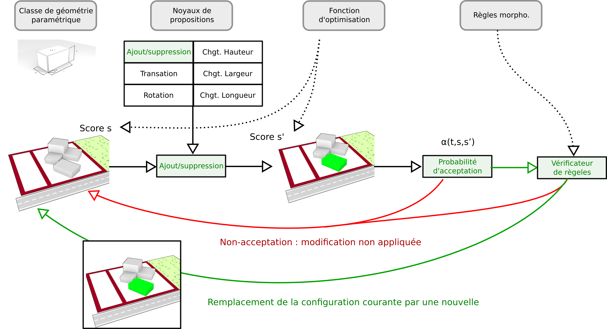

# Configuration bâtie

Dans SimPLU3D, une configuration bâtie est composée d'un ensemble de géométries paramétriques. Une géométrie paramétrique peut être décrite à travers un vecteur de dimension constante. Dans la plupart des expérimentations de SimPLU3D, comme dans l'exemple de la première simulation, les géométries paramétriques manipulées sont composées de boîtes. Dans ce cas, s'agit d'une géométrie de 6 dimensions décrite par le vecteur **b** = (**x**, **y**, **l**, **w**, **h**, **θ**). Néanmoins, il est tout à fait possible d'utiliser d'autres types de géométries paramétriques comme nous le verrons dans la section sur la [personnalisation des formes générées](custom-shape.md).

# Génération de configurations bâties

La génération de formes bâties avec SimPLU3D se base sur la technique du recuit-simulé transdimensionnel. Le recuit simulé est une technique d'optimisation et le fait que l'approche soit transdimensionnel indique que c'est le système qui détermine le nombre d'objets nécessaires pour atteindre l'objectif.

Ainsi, si on considère une fonction d'optimisation **f**, comme le volume, le recuit simulé détermine les **n** boîtes et leurs paramètres qui permettent la configuration bâtie la plus volumineuse possible.

.

# Déroulement de l'algorithme

L'algorithme est un algorithme interactif. À chaque itération, on considère une configuration bâtie courate. Le système choisit une modification parmi les noyaux de propositions de modifications disponibles (dans l'exemple, le noyau d'ajout est sélectionner pour ajouter une nouvelle boîte). Ensuite, une probabilité d'acception est déterminée, suivant la théorie du recuit simulée. Elle prend en compte les scores des configurations avant et après modification et la température courante (il s'agit d'une valeur qui décroit au fur et à mesure des itérations). Ainsi, il existe une certaine probabilité pour que cette modification soit rejetée () et une certaine probabilité - α(t,s,s’) pour que la modification soit acceptée (α(t,s,s’)). Si la configuration est acceptée, on s'assure qu'elle respecte les règles morphologiques, si c'est le cas elle remplace la configuration courante sinon la modification est rejetée.

Dans les prochaines sections, nous verrons comment paramétrer le dérouleemnt de l'algorithme à travers les paramètres qui concernent [la définition des configurations bâties et des modifications appliquées](custom-shape.md), puis [les paramètres de l'algorithme en lui-même](custom-optimisation.md).
