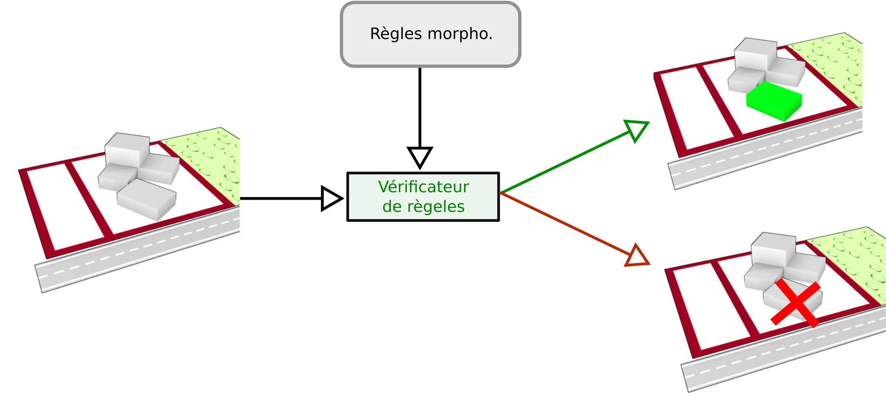

Dans le cadre du processus de simulation, l'étape de vérification des règles vise à indiquer si le résultat de l'application d'une modification sur une configuration respecte les règles morphologiques définies ou non. Dans une première partie, nous présenterons comment implémenter un [vérificateur de règles](predicate.md) dans SimPLU3D. Comme SimPLU3D effectue de base un tirage aléatoire dans un espace continu, il peut être difficile de faire que certaines règles topologiques (Par exemple, être collé contre un bâtiment existant ou une limite séparative) soient respectées. Une section sera dédiée à la définition de [telles règles topologiques](topologique.md). Il n'y a actuellement pas de format de règle propre à SimPLU3D, comme le simulateur est très générique et amené à traiter des contextes différents. Néanmoins, une section est dédiée à la [présentation rapide de quelques formats utilisés et de piste pour utiliser d'autres formats de règle](formats.md).
