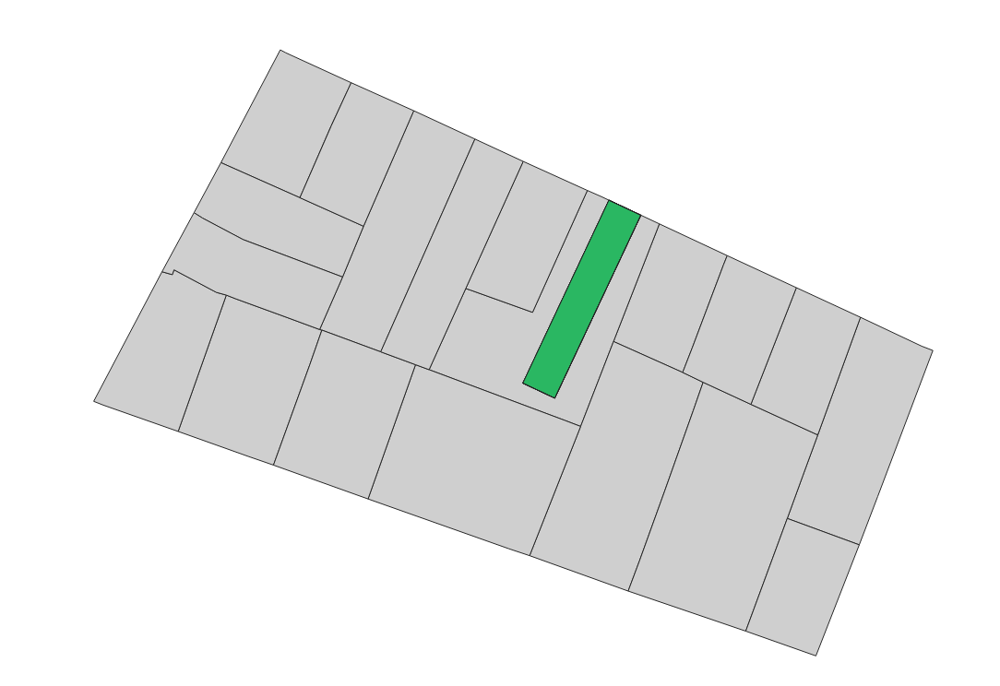

Le fonctionnement de base de SimPLU3D qui consiste à tirer des valeurs aléatoires dans un espace continu rend difficile l'application de contraintes topologiques. Si on prend l'exemple de l'alignement aux limites séparatives donnant sur une route (cf image ci-dessous), il est totalement improbable que SimPLU3D effectue le tirage d'une boîte respectant cet alignement (cela revient à tirer exactement le bonne valeur de x,y,w et θ).


# Stratégie 1 : transformation en contrainte géométrique

La stratégie naïve consisterait à transformer la contrainte topologique en contrainte géométrique. Par exemple, de vérifier si l'un des côtés de la boîte est inclus dans un buffer de petite taille autour de la limite donnant sur la voirie.

Cela rend probable la proposition de boîtes par le système, mais comme cette probabilité reste relativement faible, il peut être nécessaire d'augmenter le nombre d'itérations afin d'atteindre un résultat optimisé.

# Stratégie 2 :  génération de boîtes alignées

La seconde stratégie consiste à non plus générer des boîtes libres, mais des boîtes directement alignées sur la limite considérée. Il s'agit ainsi de définir un nouveau générateur de forme (comme décrit dans la section [**Générateur de formes - Générer d'autres types de formes**]( ../generator/custom-shape.md)).

Il s'agit non plus de générer des boîtes à 6 dimensions ( **b** = (**x**, **y**, **l**, **w**, **h**, **θ**)), mais des boîtes parallèles à 4 dimensions ( **bp** = (**x**, **y**, **l**, **h**), en considérant que l'orientation et la largeur sont imposées par les coordonnées.

## Exécutable pour la génération de boîtes alignées

Dans le projet SimPLU3D-tutorial, une classe a été ajoutée sur la base de l'exemple de base pour effectuer des simulation avec des boîtes qui seraient alignées à la limite donnant sur la voirie. Il s'agit de la classe : *fr.ign.simplu3d.topologicRule.ParallelSimulator*

```JAVA
  // NEW HERE THE PARALELLE OPTIMOIZER IS USED
  ParallelCuboidOptimizer oCB = new ParallelCuboidOptimizer();

  // IT REQUIRES AS INPUT THE GEOMETRY WHERE THE CUBOIDS HAVE TO BE ALIGNED
  IGeometry[] limits = createRoadLimits(bPU);

  // Run of the optimisation on a parcel with the predicate
  GraphConfiguration<Cuboid> cc = oCB.process(Random.random(), bPU, p, env, 0, pred, limits, bPU.getGeom());

```

La différence avec le code d'exemple de base tient en deux lignes :

- la récupération des limites le long desquelles les boîtes seront alignées ;
- l'utilisation du simulateur spécifique aux boîtes alignées (classe * fr.ign.cogit.simplu3d.rjmcmc.cuboid.optimizer.paralellcuboid.ParallelCuboidOptimizer*)

Le résultat est celui de la figure suivante. On visualise bien que la boîtes est alignée avec la limite séparative ce qui fait que le résultat
optimisé n'occupe pas l'intérieur du L.




## Définition de l'optimiseur

L'optimiseur est défini comme générant des objets de la classe  *fr.ign.cogit.simplu3d.rjmcmc.cuboid.geometry.simple.ParallelCuboid* du projet SimPLU3D composé de 4 dimensions. Néanmoins, cette classe possède les attributs orientation et width pour permettre de générer la forme de la boîte.

La différence principale avec la simulation du bâtiment en L se situe au niveau du builder (classe *fr.ign.cogit.simplu3d.rjmcmc.cuboid.builder.ParallelCuboidBuilder* du projet SimPLU3D). Le builder est défini comme ayant 4 dimensions mais il va bien renseigner les 6 dimensions de l'objet  *ParallelCuboid*.

Pour déterminer la largeur et l'orientation, une projection est effectuée depuis le point tiré aléatoirement vers la limite sur laquelle la forme est alignée. La longueur de la projection détermine la moitié de la largeur de la boîte et son azimut l'orientation de la boîte (cf code ci-dessous).

```JAVA
@Override
public Cuboid build(double[] coordinates) {
  Coordinate p = new Coordinate(coordinates[0], coordinates[1]);
  DistanceOp op = new DistanceOp(this.limits, factory.createPoint(p));
  Coordinate projected = op.nearestPoints()[0];
  double distance = op.distance();
  double orientation = Angle.angle(p, projected);
  AbstractParallelCuboid result;
  if (bandType == 1) {

    result = new ParallelCuboid(coordinates[0], coordinates[1], coordinates[2], distance * 2,
        coordinates[3], orientation + Math.PI / 2);

  } else {
    result = new ParallelCuboid2(coordinates[0], coordinates[1], coordinates[2], distance * 2,
        coordinates[3], orientation + Math.PI / 2);
  }
  return result;
}
```

Tous les autres aspects (définition des noyaux de proposition et du sampler) sont définis de la même manière que vu précédemment mais pour ces  objets à 4 dimensions.
