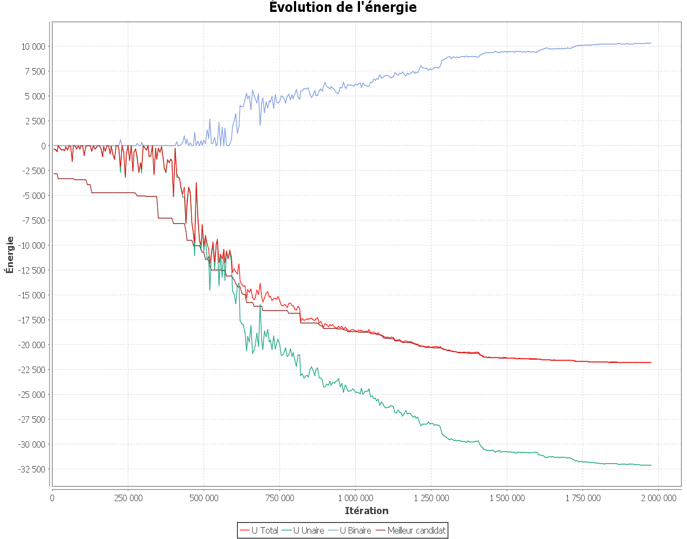
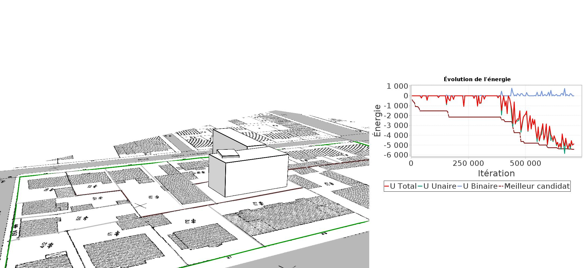

# Principe des visiteurs

Les visiteurs sont des objets qui permettent de suivre l'évolution d'une simulation en produisant régulièrement des sorties. Les visiteurs implémentent l'interface de la libjrmcmc4j *Visitor<C extends Configuration<C, M>, M extends Modification<C, M>>*. Pour un visiteur, il est possible de définir deux types de sorties : **les dumps** (qui sont des sorties rapides en termes d'exécution qui sont effectuées fréquemment) et **les saves** (qui sont des sorties plus lentes en termes d'exécution et qui sont effectuées moins fréquemment).

L'interface impose l'implémentation de 4 méthodes :

- **init(int dump, int save)** :  initialisation du visiteur avant la simulation (notamment avec ol'affectation des valeurs dump et save qui correspondent à la fréquence de production ds sorties dump et save);
- **begin(C config, Sampler<C,M> sampler, Temperature t);** : cette méthode qui est exécutée au début de la simulation ;
- **visit(C config, Sampler<C,M> sampler, Temperature t);** : cette méthode est exécutée à chaque itération, c'est ici que l'on distinguera les opérations de save et de dump avec par exemple un test de ce type :  *if ((save > 0) && (iter % save == 0)) {*;
- **end(C config, Sampler<C,M> sampler, Temperature t);** : Cette méthode est appliquée lors de la toute dernière itération de la simulation.


Dans le cadre de l'utilisation de SimPLU3D, un certain nombre de visiteurs ont été implémentées et sont activables et paramétrables via le fichier *params.json*. Les valeurs **save** et **dump** peuvent notamment y être définis pour tous les visiteurs. Vous pouvez tester ces visiteurs avec la simulation par défaut et pour toutes les autres, les paramètres ont été correctement fixés, il suffit seulement de les activer et de mettre à jour le paramètre *save* et *background_img*.

# Visiteurs de SimPLU3D

# Sortie console : OutPutStreamVisitor

L'**OutPutStreamVisitor** est le visiteur qui affiche dans la console l'état d'avancement des simulations. Il est activable par la valeur *outputstreamvisitor*.

| Nom de la colonne | Decription                                                                                         |
|:------------------|:---------------------------------------------------------------------------------------------------|
| Iteration         | Numéro de l'itération courante                                                                     |
| Objects           | Nombre d'objets dans la simulation courante                                                        |
| A - Nom de noyau  | Probabilité moyenne (sur les *dump* dernière itérations) que le noyau concerné soit choisi         |
| P - Nom du noyau  | Probabilité moyenne (sur les *dump* dernière itérations) qu'une application du noyau soit acceptée |
| Temp              | Valeur de la température                                                                           |
| Accept            | Probabilité moyenne (sur les *dump* dernière itérations) qu'une modification soit acceptée         |
| Time (ms)         | Temps d'exécution                                                                                  |
| u_1               | Valeur de l'énergie unaire                                                                         |
| u_2               | Valeur de l'énergie binaire                                                                        |
| u                 | Valeur de l'énergie combinée                                                                       |


# Sortie shapefile : ShapefileVisitor

Le **ShapefileVisitor**  est le visiteur qui permet de sauvegarder des shapefiles toutes les *save* itérations. Il est activables par la valeur *shapefilewriter*.

Il est nécessaire également de paramétrer la valeur *result* qui indique le dossier dans lequel les shapefiles seront exportés. Ils portent comme nom le numéro de l'itération et les objets sauvegardés auront comme attributs la valeur d'énergie et de la méthode *toString()*.

# Sortie sous forme de graphique : StatsVisitor


Le **StatsVisitor** permet la représentation de l'évolution de l'énergie au cours de la simulation sous forme de graphes. Il est activable par la valeur *statsvisitor*.

Plusieurs informations sont représentées comme l'énergie unaire, l'énergie binaire, l'énergie de la meilleure configuration rencontré et l'énergie de la configuration actuel. L'image ci-dessous présente le graphique qui peut être visualisé.



Petite astuce : comme le résultat d'une simulation est la dernière configuration rencontrée, ce graphique est utile pour visualiser si le meilleur candidat rencontré est bien cette dernière configuration. Normalement les courbes "Meilleur candidat" et "Énergie de la configuration actuelle" doivent être confondus en fin de simulation.

# Sortie CSV : CSVvisitor et CSVendStats

Deux visiteurs permettent l'export de sorties sous forme de CSV : *CSVvisitor* et *CSVendStats* activables respectivement avec les valeurs *csvvisitor* et *csvvisitorend*.

Dans les deux cas, la valeur de *result* détermine le dossier de stockage des fichiers qui s'appelleront *csvfilename* et *csvfilenamend*.

Le premier CSV contiendra une ligne par itération et stockera des informations sur la configuration courante : numéro de l'itération, taille de la configuration, énergie de la configuration courante et énergie moyenne sur les *dump* dernière itérations.

Le second CSV contient les information de fin de simulation par parcelle (pratique lorsque l'on effectue des simulations sur plein de parcelles) et notamment, le nombre d'itérations, le temps d'exécution, la taille de la configuration et l'énergie.


# Visualisation 3D à la volée des résultats : ViewerVisitor

Le *ViewerVisitor* permet de visualiser en 3D les évolutions de la simulation en cours. Il est activable par la valeur *visitorviewer* et permet de représenter les données chargées et la simulation avec une mise à jour toutes les *dump* itérations.

Quelques options d'affichage sont disponibles, comme le fait d'activer un plan contenant une image fixe avec l'option *showbackground*. Il est nécessaire de fixer le chemin absolu vers l'image utilisée *background_img* (à mettre à jour si vous voulez activer ce visualiseur pour le première simulation) et l'altitude de ce plan (valeur *z*.). Les coordonnées de ce plan sont fixées par les valeurs *xminbg*, *yminbg*, *xmaxbg* et *ymaxbg*. Il est également possible de choisir la coulveur du fond de scène avec les options *filmvisitorr*, *filmvisitorg* et *filmvisitorb":"180*.

Lors de l'utilisation de ce visiteur, la caméra se positionnera au centre de la scène.

>  **Attention**: : pour ce visiteur, la visualisation 3D e nécessitent l'utilisation de bibliothèques natives (qui se trouvent dans le projet). Il est nécessaire de passer à la VM l'argument suivant :
>
> **-Djava.library.path=./lib/native_libraries/linux-amd64**  
>
> La ligne précédente est définie pour Linux 64 bits, au besoin, il faut remplacer linux-amd64 par windows-i586 (windows 32bits), windows-amd64 (windows 64bits) ou linux-i386 (linux 32bits) en fonction de l'OS utilisé.

# Export d'image à la volée : FilmVisitor

Le *FilmVisitor* permet d'exporter le rendu des simulations sous forme de .jpeg toutes les *dump* itérations. Si le *StatsVisitor* est activé, l'image de la simulation et l'image de ce visiteur se retrouvent conjointement exportées (cf image ci-dessous).




Les paramètres du *FilmVisitor* sont tout d'abord ceux du *ViewerVisitor*. Il est également nécessaire de définir la valeur *save* pour désigner le répertoire dans lequel les images seront exportées.

Il est également nécessaire de définir les coordonnées de la position de la caméra avec les coordonnées *filmvisitorx*, *filmvisitory* et *filmvisitorz*  et la direction dans laquelle regarde la caméra avec les coordonnées : *filmvisitorvecty*, *filmvisitorvectx* et *filmvisitorvectz*.


# Utilisation d'autres visiteurs


Il est totalement possible d'implémenter d'autres visiteurs en étendant l'interface *Visitor<C extends Configuration<C, M>, M extends Modification<C, M>>*. Pour les optimiseur déjà définis, la classe *fr.ign.cogit.simplu3d.rjmcmc.generic.visitor.PrepareVisitors* du projet SimPLU3D permet d'initialiser les visiteurs et d'en rajouter d'autres via la liste *lSupplementaryVisitors*.

Sinon, de manière générale les visiteurs sont passés en paramètre de la méthode qui lance l'optimisation *SimulatedAnnealing.optimize* qui prend un objet de la classe *CompositeVisitor* en paramètre. L'instanciation d'un *CompositeVisitor* ne requiert qu'une liste de visiteur comme montré dans le code ci-dessous.


```JAVA
  List<Visitor<GraphConfiguration<C>, BirthDeathModification<C>>> list = new ArrayList<>();
  list.addAll(lSupplementaryVisitors);
	CompositeVisitor<GraphConfiguration<C>, BirthDeathModification<C>> mVisitor = new CompositeVisitor<>(list);
  ```
